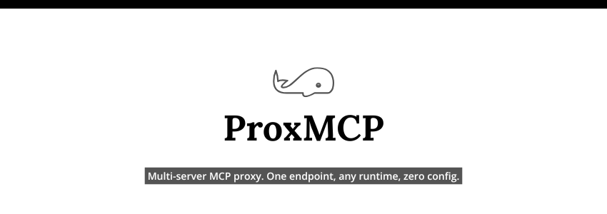

<div align="center">



# ProxMCP

A lightweight, pluggable MCP (Model Context Protocol) proxy that aggregates multiple upstream MCP servers behind a single endpoint — with auth, rate limiting, logging, and tool filtering built in.


</div>

---

## Why ProxMCP

Running MCP servers in production comes with a set of problems that ProxMCP solves out of the box:

- **Transport normalization** — Legacy SSE-only clients can connect to upstreams that speak only Streamable HTTP. ProxMCP exposes a `GET /sse` endpoint for backward compatibility and converts everything into JSON-RPC 2.0 internally.
- **Multi-server aggregation** — Expose many upstream MCP servers (filesystem, database, web search, GitHub, …) behind a single `/mcp` endpoint. Tools are merged, conflicts are warned, and routing is automatic.
- **Auth & rate limiting** — Add API key authentication and per-IP / per-key rate limits without modifying your upstream servers. Works as a transparent proxy.
- **Deploy anywhere Hono runs** — Node.js, Bun, Cloudflare Workers, Deno. One codebase, zero platform lock-in.

---

## Quick Start

```bash
npx proxmcp --upstream http://localhost:3001/mcp
```

This starts ProxMCP on `http://localhost:3000/mcp`, proxying to your upstream server. No config file needed.

---

## Configuration

### Zero-config (CLI flags)

```bash
proxmcp \
  --upstream http://localhost:3001/mcp \
  --upstream http://localhost:3002/mcp \
  --port 8080 \
  --api-key sk-secret \
  --rate-limit 60 \
  --log-format pretty
```

### Config file

Create `proxmcp.config.ts`:

```ts
import { defineConfig } from '@proxmcp/core'
import { authPlugin } from '@proxmcp/plugin-auth'
import { rateLimitPlugin } from '@proxmcp/plugin-rate-limit'
import { loggerPlugin } from '@proxmcp/plugin-logger'
import { toolFilterPlugin } from '@proxmcp/plugin-tool-filter'

export default defineConfig({
  port: 3000,
  upstreams: [
    {
      id: 'filesystem',
      url: 'http://localhost:3001/mcp',
      transport: 'streamable-http',
    },
    {
      id: 'github',
      url: 'http://localhost:3002/mcp',
      transport: 'streamable-http',
    },
    {
      id: 'legacy-sse-server',
      url: 'http://localhost:3003/sse',
      transport: 'sse',
    },
  ],
  plugins: [
    authPlugin({ mode: 'apikey', keys: process.env.PROXMCP_API_KEY! }),
    rateLimitPlugin({ limit: 100, windowMs: 60_000, keyBy: 'ip' }),
    loggerPlugin({ format: 'pretty' }),
    toolFilterPlugin({
      rename: { read_file: 'get_file' },
      deny: ['delete_file', 'drop_database'],
      sanitizeDescriptions: true,
    }),
  ],
})
```

Then run:

```bash
proxmcp --config ./proxmcp.config.ts
```

---

## Plugin Reference

| Plugin          | Description                                        | Import                                     |
|-----------------|----------------------------------------------------|--------------------------------------------|
| `authPlugin`    | API key authentication (header or Bearer token)    | `@proxmcp/plugin-auth`                     |
| `rateLimitPlugin` | Sliding-window rate limiting by IP, API key, or global | `@proxmcp/plugin-rate-limit`           |
| `loggerPlugin`  | Structured JSON or pretty-print request logging    | `@proxmcp/plugin-logger`                   |
| `toolFilterPlugin` | Allow/deny, rename, override descriptions, sanitize prompts | `@proxmcp/plugin-tool-filter`     |

---

## Upstream Transport Support

| Transport        | Supported | Notes                                          |
|------------------|-----------|------------------------------------------------|
| Streamable HTTP  | ✅         | Default. Uses MCP SDK's `StreamableHTTPClientTransport`. |
| SSE              | ✅         | Legacy SSE transport. Uses MCP SDK's `SSEClientTransport`. |
| stdio            | ✅         | Spawn a local subprocess. Requires `command[]` in config. |

ProxMCP also exposes a `GET /sse` endpoint for legacy SSE-only clients to connect.

---

## Deployment

### Node.js / Bun

```bash
# Install globally
npm install -g proxmcp

# Or run directly
npx proxmcp --upstream http://localhost:3001/mcp

# With Bun
bunx proxmcp --upstream http://localhost:3001/mcp
```

### Cloudflare Workers

Create a Worker that imports and wraps ProxMCP:

```ts
// src/index.ts
import { ProxMCP } from '@proxmcp/core'
import { authPlugin } from '@proxmcp/plugin-auth'

const proxy = new ProxMCP({
  upstreams: [
    { id: 'api', url: 'https://my-mcp-server.example.com/mcp' },
  ],
  plugins: [
    authPlugin({ mode: 'apikey', keys: MY_API_KEY }),
  ],
});

// Hono's fetch handler is compatible with Cloudflare Workers
export default { fetch: proxy.getApp().fetch }
```

### Docker

```dockerfile
FROM node:22-alpine
WORKDIR /app
COPY package*.json ./
COPY packages/core/package.json packages/core/
COPY packages/plugins/*/package.json packages/plugins/*/
COPY packages/cli/package.json packages/cli/
RUN npm ci --workspaces
COPY . .
RUN npm run build --workspaces
EXPOSE 3000
ENTRYPOINT ["node", "packages/cli/dist/cli.js"]
```

Build and run:

```bash
docker build -t proxmcp .
docker run -p 3000:3000 proxmcp --upstream http://host.docker.internal:3001/mcp
```

---

## Plugin API

Writing a custom plugin is straightforward — implement the `ProxMCPPlugin` interface:

```ts
import type { ProxMCPPlugin, ProxMCPContext } from '@proxmcp/core'

export function myPlugin(): ProxMCPPlugin {
  return {
    name: 'my-custom-plugin',

    onRequest(ctx: ProxMCPContext, request: Request): Response | void {
      // Return a Response to block the request (e.g., 403 Forbidden)
      // Return void to allow it through
    },

    onResponse(ctx: ProxMCPContext, response: Response, durationMs: number): void {
      // Side-effect only — cannot modify the response
    },

    onError(ctx: ProxMCPContext, error: unknown): void {
      // Called when an upstream request fails
    },

    filterTools(tools: ProxMCPTool[]): ProxMCPTool[] {
      // Filter, rename, or sanitize tool definitions
      return tools
    },
  }
}
```

The four hooks (`onInit`, `onRequest`, `onResponse`, `onError`, plus `filterTools`) give you full control over the request lifecycle.

---

## Security Notes

- **Tool description sanitization** — The `toolFilterPlugin` can strip common prompt-injection patterns (`"ignore previous instructions"`, `"system prompt"`, long uppercase strings) from tool descriptions via `sanitizeDescriptions: true`.
- **Timing-safe key comparison** — API key validation uses XOR-based constant-time comparison to prevent timing side-channel attacks.
- **What ProxMCP does NOT protect against** — Prompt injection in user messages (not tool descriptions), data exfiltration through tool call arguments, or upstream server vulnerabilities. ProxMCP is a routing and policy layer, not a sandbox.

---

## Contributing

MIT License. PRs and issues are welcome.

See [CONTRIBUTING.md](CONTRIBUTING.md) for local setup and testing instructions.
